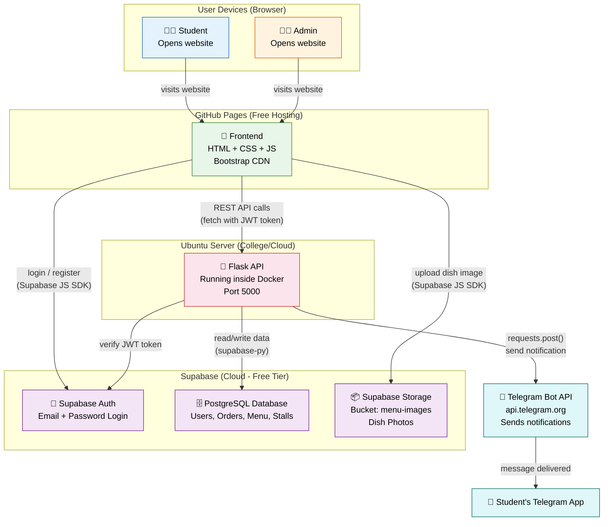
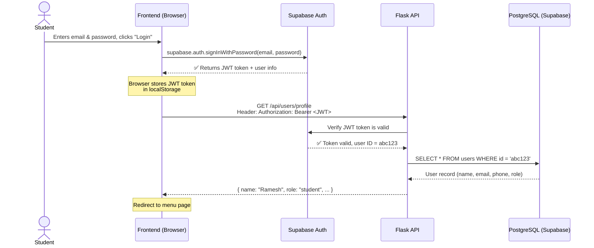
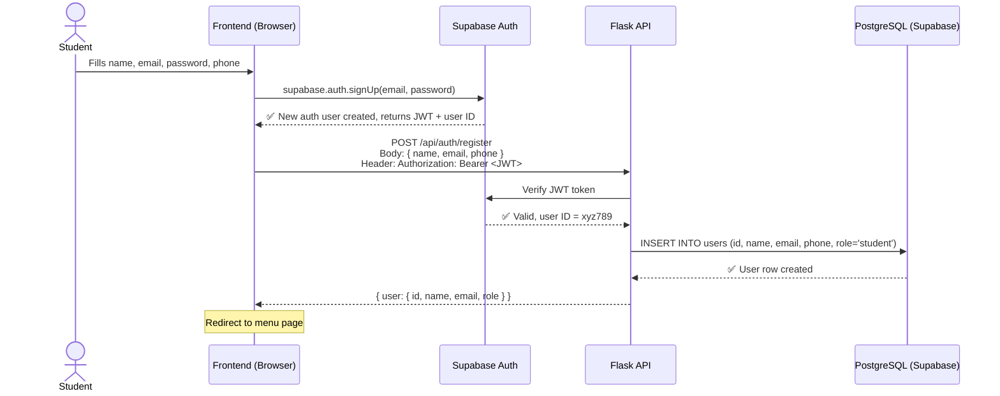
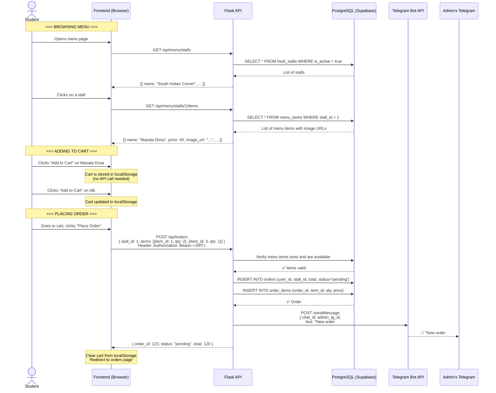
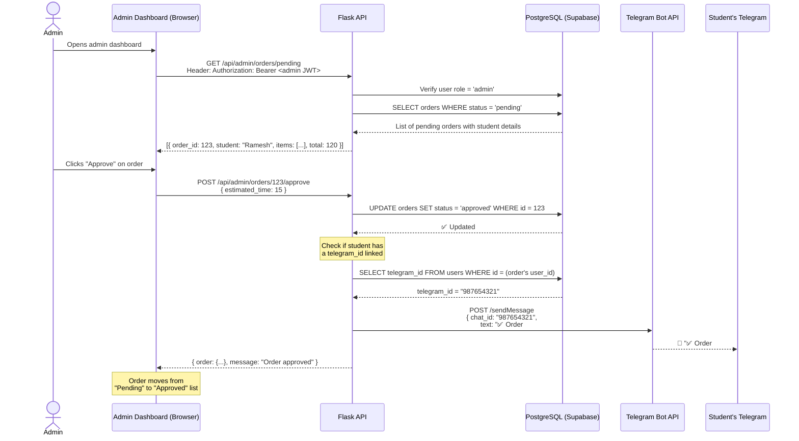
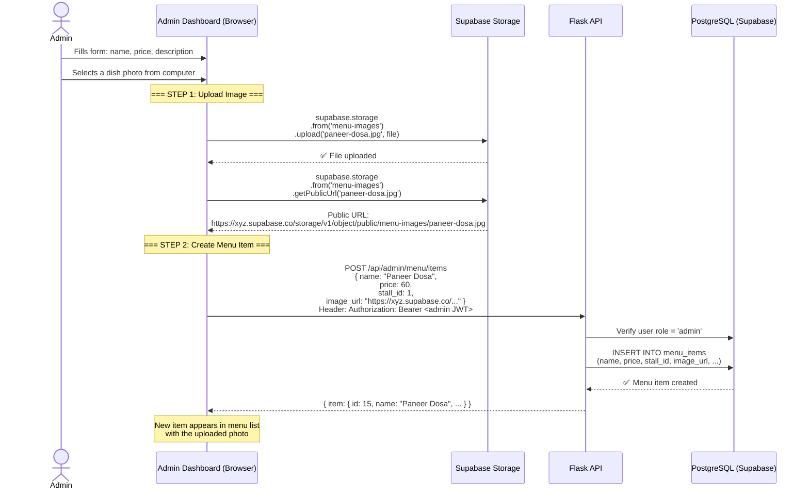
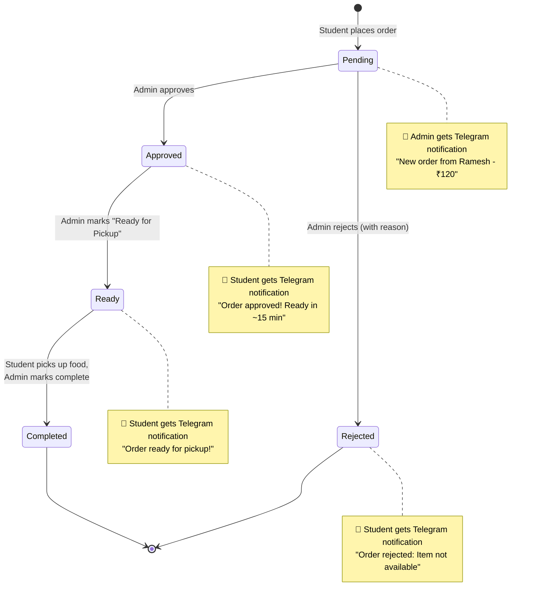
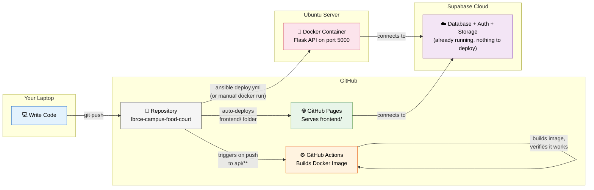
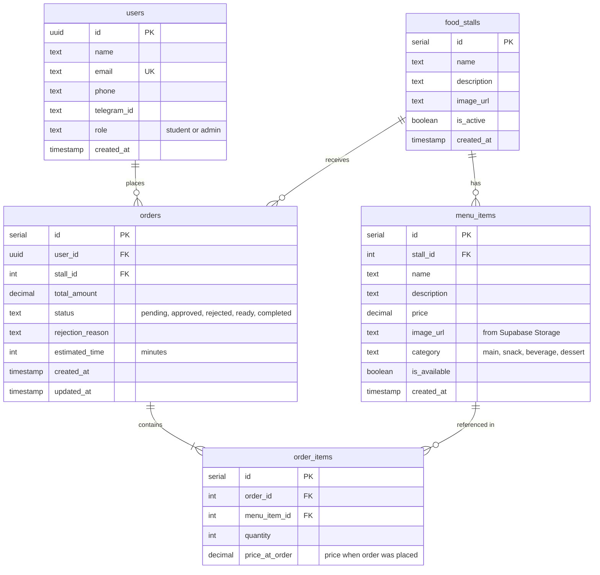

# System Diagrams

> All diagrams use [Mermaid.js](https://mermaid.js.org/) syntax.
> You can preview them on GitHub (renders automatically), in VS Code with the **Mermaid Preview** extension, or at [mermaid.live](https://mermaid.live).

---

## 1. System Architecture

This shows **what** each piece of the system is and **how** they talk to each other.



### Key Points for Students

| Component                      | Where it runs                     | Who builds it     |
| ------------------------------ | --------------------------------- | ----------------- |
| Frontend (HTML/CSS/JS)         | GitHub Pages (free)               | Team 4            |
| Flask API                      | Docker container on Ubuntu server | Team 2            |
| Supabase (DB + Auth + Storage) | Cloud (supabase.com, free tier)   | Team 1 sets it up |
| Telegram notifications         | Called from Flask API             | Team 3            |
| Docker + Ansible + CI          | Ubuntu server + GitHub Actions    | Team 5            |

---

## 2. How Login Works

What happens step-by-step when a student logs in.



---

## 3. How Registration Works

What happens when a new student creates an account.



---

## 4. Browsing Menu and Placing an Order

The main flow — student picks food and places an order.



---

## 5. Admin Approves an Order (with Telegram Notification)

What happens when admin reviews and approves a pending order.



---

## 6. Admin Adds a Menu Item (with Image Upload)

How an admin uploads a dish photo and creates a new menu item.



### Why Upload Works This Way

```
❌ BAD:  Browser → Flask API → save file to disk
         (complex, needs file handling, storage limits)

✅ GOOD: Browser → Supabase Storage (direct upload)
         Browser → Flask API (just sends the URL string)
         Flask stores only the URL — zero file handling!
```

---

## 7. Complete Order Lifecycle

All the states an order goes through from start to finish.



---

## 8. Deployment Architecture

How code gets from your laptop to the live servers.



### Deployment Steps (Simple Version)

```
1. Push code to GitHub          →  git push origin main
2. Frontend auto-deploys        →  GitHub Pages serves frontend/ folder
3. API deployed manually        →  SSH into server, docker build, docker run
   OR via Ansible               →  ansible-playbook deploy.yml
4. GitHub Actions               →  Automatically builds Docker image to verify it works
```

---

## 9. Database Relationships (ER Diagram)

How the database tables connect to each other.



### Reading the Diagram

| Symbol      | Meaning                                                       |
| ----------- | ------------------------------------------------------------- |
| `PK`        | Primary Key — unique identifier for each row                  |
| `FK`        | Foreign Key — links to another table's PK                     |
| `UK`        | Unique Key — no duplicates allowed                            |
| `\|\|--o{`  | One-to-many: one user has many orders                         |
| `\|\|--\|{` | One-to-many (required): one order must have at least one item |

---

## How to Preview These Diagrams

1. **GitHub** — Push this file and open it on github.com. Mermaid diagrams render automatically.

2. **VS Code** — Install the extension: `Markdown Preview Mermaid Support`

   ```
   Extensions → Search "Mermaid" → Install "Markdown Preview Mermaid Support"
   Then: Cmd+Shift+V to preview this file
   ```

3. **Online** — Copy any diagram code block and paste it at [mermaid.live](https://mermaid.live)
